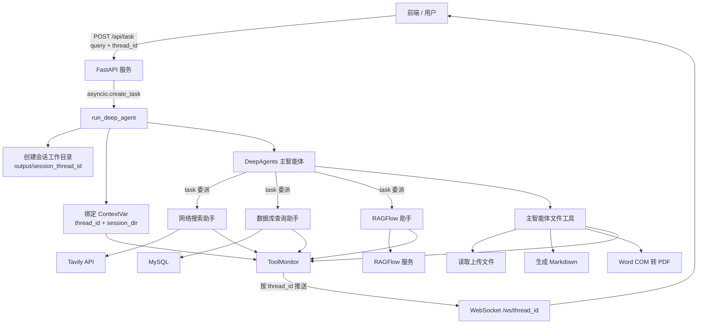

<div align="center">

# Enterprise Deep Research Agent

### 面向企业多源知识的 Deep Research 多智能体系统

一个基于 **DeepAgents / LangGraph** 的深度研究应用：由主智能体拆解和调度任务，联合互联网搜索、MySQL 业务数据与 RAGFlow 内部知识库完成多源研究，并通过 WebSocket 实时呈现执行过程，最终生成 Markdown / PDF 研究文档。


</div>

## 💡 项目背景

传统 RAG 往往只针对单一知识库执行一次检索，难以处理需要外部信息、企业私域知识和结构化业务数据交叉验证的复杂问题。

本项目将研究过程拆分为“任务规划 → 专家委派 → 多轮检索 → 结果综合 → 文档交付”，并将不同数据边界封装为独立子智能体，使主智能体可以根据问题动态选择数据源、迭代追问并汇总结论。

## ✨ 核心特性

- **多智能体协作**：主 Agent 统一规划任务，按需委派网络搜索、数据库查询和 RAGFlow 知识库三类专家 Agent。
- **多源深度研究**：同时覆盖公开网络信息、企业内部文档与 MySQL 结构化数据，支持递进式检索和交叉补充。
- **异步任务与实时可观测**：FastAPI 后台异步执行长任务，WebSocket 按 `thread_id` 推送子 Agent 调用、工具执行和文件生成进度。
- **文件理解与研究交付**：支持读取 Markdown、Word、PDF 和 Excel，并将研究结果输出为 Markdown / PDF。
- **会话级资源隔离**：使用 `ContextVar` 绑定任务目录和 WebSocket 会话，避免并发任务之间的路径与消息污染。
- **工具层安全边界**：文件路径强制限定在当前会话目录；SQL 限制为单条只读查询，配合只读事务与结果行数上限降低风险。
- **模型与提示词可配置**：兼容 OpenAI 协议的模型服务，主子 Agent 角色与工作流集中维护在 YAML 中。

## 🎬 效果展示

### 1. 完整研究对话

<!-- 建议展示：多源研究问题、最终结论和任务完成状态。图片放在 docs/images/research-result.png。 -->
<!--  -->

### 2. 多智能体执行过程

<!-- 建议展示：主 Agent → 子 Agent → 具体工具的实时日志，优先使用 GIF。文件放在 docs/images/agent-workflow.gif。 -->
<!--  -->

### 3. 文件上传与分析

<!-- 建议展示：上传 PDF / Excel 后，Agent 结合文件和外部数据完成分析。图片放在 docs/images/file-analysis.png。 -->
<!--  -->

### 4. 研究报告交付

<!-- 建议展示：Markdown / PDF 文件列表和 PDF 报告首页或目录。图片放在 docs/images/report-delivery.png。 -->
<!--  -->

## 🏗️ 系统架构



## 🔄 工作流程

1. 前端为会话生成 `thread_id`，可先上传用户文件，再通过 `/api/task` 提交研究问题。
2. FastAPI 在后台启动异步 Agent 任务，并立即向前端返回会话 ID。
3. 运行时为任务创建 `output/session_{thread_id}` 独立工作目录，复制上传文件并绑定异步上下文。
4. 主 Agent 根据问题拆解 TODO，将子任务分派给合适的专家 Agent。
5. 专家 Agent 独立使用 Tavily、MySQL 或 RAGFlow 获取信息，结果返回主 Agent 继续迭代研究。
6. 主 Agent 综合多源结果，直接回答用户，或按需生成 Markdown / PDF 报告。
7. 全过程的子 Agent 调用、工具进度和最终结果通过 WebSocket 定向推送给当前会话。

## 🧠 Agent 设计

| Agent | 数据边界 | 工具 | 典型任务 |
| --- | --- | --- | --- |
| Main Agent | 任务全局 | `task`、`read_file`、`generate_markdown`、`convert_md_to_pdf` | 任务规划、子任务分发、信息综合与文档交付 |
| Network Search Agent | 互联网公开信息 | `internet_search` | 行业背景、时效信息、政策与市场资料 |
| Database Agent | MySQL 业务数据 | `list_sql_tables`、`get_table_data`、`execute_sql_query` | 表结构探查、数据筛选、联表与聚合分析 |
| RAGFlow Agent | 企业内部知识库 | `get_assistant_list`、`create_ask_delete` | 选择知识库助手、多角度追问、回收内部知识 |

## 🛡️ 安全与隔离设计

LLM 输出不应被直接信任，因此项目在工具层而不是仅在 Prompt 中实施约束：

- 会话 ID 仅允许字母、数字、下划线和连字符，防止通过 ID 构造路径穿越。
- 文件路径解析后必须位于当前 `session_dir`，否则拒绝读写。
- 上传文件只保留安全文件名，不使用客户端提供的目录。
- 自定义 SQL 仅允许单条 `SELECT` 或 `WITH ... SELECT`，禁止写操作、多语句、文件导出与锁定查询。
- SQL 在 MySQL 只读事务中执行，最多向 Agent 返回 1000 行数据。

## 🛠️ 技术栈

| 类别 | 技术 |
| --- | --- |
| Agent 编排 | DeepAgents、LangGraph、LangChain |
| LLM | OpenAI-compatible Chat Model / DeepSeek |
| Web 后端 | FastAPI、Uvicorn、WebSocket、Pydantic |
| 外部搜索 | Tavily Search API |
| 内部知识 | RAGFlow SDK |
| 结构化数据 | MySQL Connector/Python |
| 文件处理 | pandas、openpyxl、python-docx、pypdf、Markdown、Word COM |
| 前端 | Vue 3、TypeScript、Vite、Axios、Marked |
| 工程化 | uv、YAML 提示词配置、Loguru日志 |

## 📁 项目结构

```text
deep-search-agent/
├── agent/
│   ├── main_agent.py                 # 主 Agent 创建与运行时入口
│   ├── llm.py                        # OpenAI-compatible 模型配置
│   ├── prompts.py                    # YAML 提示词加载
│   └── sub_agents/                   # 网络、DB、RAGFlow 子 Agent
├── api/
│   ├── server.py                     # HTTP / WebSocket API
│   ├── context.py                    # 会话级 ContextVar
│   └── monitor.py                    # 执行事件监控与推送
├── tools/
│   ├── tavily_tool.py                # 网络搜索
│   ├── db_tools.py                   # MySQL 只读查询
│   ├── rag_tools.py                  # RAGFlow 知识库查询
│   ├── upload_file_read_tool.py      # 多格式文件读取
│   ├── markdown_tool.py              # Markdown 文档生成
│   └── pdf_tool.py                   # PDF 转换工具
├── utils/
│   ├── path_utils.py                 # 路径规范化与越界防护
│   └── word_convert.py               # Markdown → HTML → Word → PDF
├── prompt/prompts.yaml             # 主子 Agent 角色与工作流
├── output/                        # 会话输出（Git 忽略）
├── upload/                        # 临时上传（Git 忽略）
├── pyproject.toml
└── uv.lock
```

Web UI 作为独立 Vue 3 工程运行，通过 `http://127.0.0.1:8000` 与本后端交互。

## 🚀 快速开始

### 1. 环境要求

- Python 3.12+
- [uv](https://docs.astral.sh/uv/)
- Node.js 20+ 与 npm（运行 Web UI）
- MySQL（使用数据库 Agent 时）
- 可访问的 RAGFlow 服务（使用知识库 Agent 时）
- Windows + Microsoft Word（使用 PDF 转换时）

### 2. 安装后端依赖

```bash
git clone <your-repository-url>
cd deep-search-agent
uv sync
```

### 3. 配置环境变量

根据实例配置`.env`文件：

```dotenv
# OpenAI 协议兼容的模型服务
OPENAI_BASE_URL=https://your-llm-provider.example/v1
OPENAI_API_KEY=your_api_key
LLM_DEEPSEEK=your_model_name

# 公开网络搜索
TAVILY_API_KEY=your_tavily_api_key

# RAGFlow 内部知识库
RAGFLOW_API_URL=http://your-ragflow-host
RAGFLOW_API_KEY=your_ragflow_api_key

# MySQL 业务数据（设置只读权限）
MYSQL_HOST=127.0.0.1
MYSQL_PORT=3306
MYSQL_USER=readonly_user
MYSQL_PASSWORD=your_password
MYSQL_DATABASE=your_database
```

### 4. 启动后端

```bash
uv run uvicorn api.server:app --reload --host 0.0.0.0 --port 8000
```

启动后可访问：

- Swagger API 文档：`http://127.0.0.1:8000/docs`
- WebSocket：`ws://127.0.0.1:8000/ws/{thread_id}`

### 5. 启动前端

在 Vue 3 Web UI 项目目录中执行：

```bash
npm install
npm run dev
```

默认访问 `http://127.0.0.1:5173`。前端当前预设后端地址为 `http://127.0.0.1:8000`。

## 🔌 API 概览

| 方法 | 路径 | 说明 |
| --- | --- | --- |
| `POST` | `/api/task` | 提交研究问题，后台启动 Agent 并返回 `thread_id` |
| `POST` | `/api/upload` | 将多个文件上传到指定会话 |
| `GET` | `/api/files` | 获取当前会话的生成文件列表 |
| `GET` | `/api/download` | 下载 `output` 目录中的生成文件 |
| `WS` | `/ws/{thread_id}` | 接收会话级实时执行事件 |

启动任务示例：

```bash
curl -X POST http://127.0.0.1:8000/api/task \
  -H "Content-Type: application/json" \
  -d '{"query":"结合公开信息、内部知识和业务数据，生成一份市场分析报告"}'
```

## 📊 设计取舍

- **为什么使用子 Agent？** 将不同数据边界与工具集隔离，降低单 Agent 上下文混杂和工具误用风险。
- **为什么使用 HTTP + WebSocket？** 深度研究是长时间任务，HTTP 负责快速受理，WebSocket 负责持续反馈，避免长连接 HTTP 超时。
- **为什么使用 ContextVar？** 它可以在异步调用链中传递会话信息，同时避免普通全局变量被并发请求覆盖。
- **为什么在工具层限制路径与 SQL？** Prompt 只是行为引导，无法作为安全边界；真正的访问限制必须在确定性代码中执行。

## 🗺️ Roadmap

- [ ] 引入 LangGraph Checkpointer，支持服务重启后的会话恢复
- [ ] 为搜索结果增加来源去重、可信度评分与引用溯源
- [ ] 增加 Agent 调用链路、Token 成本和任务耗时指标
- [ ] 建立工具单测、Agent 轨迹回归测试和 CI 流水线
- [ ] 将 Word COM PDF 转换替换或补充为跨平台方案
- [ ] 将前后端服务地址与 CORS 策略改为环境化配置

## ⚠️ 当前限制

- `thread_id` 当前用于会话路由、输出目录和运行时配置，项目尚未配置持久化 Checkpointer。
- 各外部能力需要可用的模型服务、Tavily、RAGFlow 和 MySQL 配置。
- 项目当前为学习与工程实践版本，生产部署前还需增加身份认证、请求限流、密钥管理和更完整的沙箱隔离。

## 📄 License

本项目基于 [MIT License](LICENSE) 开源。
